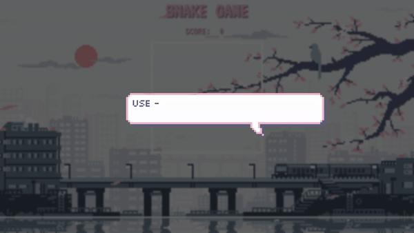

# JS Snake game

This is a basic snake game made with the HTNL canvas element.

To run the project just copy the link and run `git clone`. 
Then open `index.html` in your favourite browser.
No dependencies needed.

To play the game click here: https://ivanaogrizovic.github.io/snake-game/

Please note: this project was a quick build to play with the <canvas> tag. It is not responsive nor it will be made responsive for the moment.

